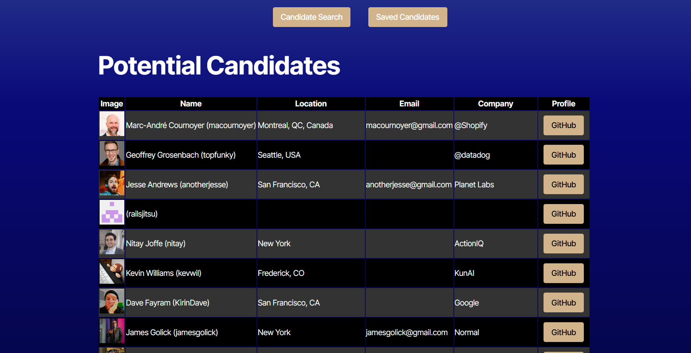

# Candidate Search 

## Table of Contents
- ###[Description](#description)
- ###[Usage](#usage)
- ###[Features](#features)
- ###[Installation](#installation)
- ###[Screenshots](#screenshots)
- ###[License](#license)
- ###[Contributors](#contributors)
- ###[Questions](#questions)

## Description
The Candidate Search page allows users to efficiently browse and evaluate a list of potential candidates. With an intuitive interface, users can view detailed profiles for each candidate, including their name, location, email, company, and GitHub profile. The page supports actions such as accepting or rejecting candidates, with the ability to track and store decisions in local storage. Users can load new candidates, ensuring that only unique candidates are displayed, and monitor their progress with a visual indicator. Additionally, the page offers access to a saved list of accepted candidates for easy reference.

## Usage
To use the Candidate Search, simply navigate to the page where you will see a list of candidate profiles. You can load new candidates by clicking the "Load New Candidates" button, which will display a batch of candidates that haven't been reviewed yet. For each candidate, you'll find details such as their name, location, email, company, and a link to their GitHub profile. If you wish to accept a candidate, click the "Accept (+)" button, or if you'd like to reject them, click the "Reject (-)" button. Accepted and rejected candidates are saved automatically for later reference, and you can view your saved candidates by clicking the link at the top of the page. As you review candidates, a progress bar will help track your current position in the list. The page ensures that no candidate is shown more than once, offering a smooth and efficient review process.

## Features
#### The option to load new candidates to search.
#### The option to accept or reject candidates and save them.
#### The option to view the saved accepted candidates.

## Installation
#### Clone the Respository: In your CLI, type the following syntax: git clone git@github.com:jaystrand/candidate_search.git
#### Install the required dependencies: Use the following syntax: npm install
#### Next, build the code by typing "npm run build" in the terminal
#### Start the applications: Type the following syntax: npm run dev

## Screenshots

## Contributors
#### Jermaine Strand

## Questions
For any questions, please contact me at: 

#### jermaine.strand@yahoo.com

#### GitHub: https://github.com/jaystrand/candidate_search
#### Render: https://candidate-search-qt7g.onrender.com